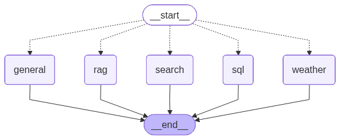

# Multi-Tool Agentic AI System with LangGraph

A fully routed multi-agent workspace built using LangGraph, LangChain, and Gemini. This system dynamically interprets user intent to direct queries across web search tools, an internal RAG knowledge base, a relational SQL database, or a baseline weather simulator, while maintaining complete conversation persistence across sessions[cite: 3, 4].

---

## 1. System Overview

The application follows a central hub-and-spoke multi-agent architecture orchestrated entirely via LangGraph[cite: 3, 4, 111]. 

### Node Connectivity & Workflow
1. **START Entry Node**: Receives incoming conversation frames.
2. **Intent Router (`route_intent`)**: Performs structured few-shot classification at `temperature=0` to evaluate user intention. It maps inputs directly to one of 5 dedicated downstream processing nodes using conditional branching[cite: 60, 62, 70, 71].
3. **Execution Nodes**:
   - `search`: Executes a live Tavily Web Search and answers strictly using external references[cite: 10, 13, 15].
   - `rag`: Queries a local vector repository to provide document-grounded context[cite: 22, 27, 30].
   - `sql`: Compiles, validates, and runs secure, read-only queries against database tables[cite: 41, 51].
   - `weather`: Returns local baseline simulation statistics[cite: 6].
   - `general`: Manages greetings, casual dialog, and context summaries[cite: 6].
4. **END Exit Node**: Captures output and safely concludes execution steps.

The structured graph routing topology is illustrated below:



---

## 2. Setup Instructions

### Prerequisites
Ensure you have Python 3.11+ installed.

### Installation
1. Clone the repository and navigate into the project directory.
2. Install the necessary system dependencies:
   ```bash
   pip install -r requirements.txt
   pip install langchain-google-genai langchain-huggingface pypdf
Configuration
Create a local .env file in the root directory and append your secure API keys:  
PDF
+ 1

Ini, TOML
GOOGLE_API_KEY=your_gemini_api_key_here
TAVILY_API_KEY=your_tavily_api_key_here
Database & Knowledge Base Initialization
The chroma_db vector store and data/database.db SQLite database are included in this repository and ready to use. If you need to rebuild the SQL database from scratch:  
PDF

Bash
sqlite3 data/database.db < data/schema.sql
3. How to Run
Launch the interactive terminal session by executing:  
PDF
+ 2

Bash
python main.py
Session Persistence

New Session: Press [Enter] on launch to generate a new, unique transaction context.  
PDF
+ 1


Resume Session: Provide a pre-existing 8-character ID string to pull history directly from long-term database tables.  
PDF
+ 1

4. Knowledge Base (Feature 2)

Selected Domain: Corporate Operations and Academic Policy Manuals.  
PDF
+ 2


Documents Included: A 5-document target corpus comprising mixed-format extensions (plain-text and PDF) stored inside data/knowledge_base/.  
PDF
+ 1


Engine Details: Embedded using sentence-transformers/all-MiniLM-L6-v2 and managed through a local ChromaDB instance.  
PDF

5. Relational Database (Feature 3)

Selected Domain: Corporate Human Resources & Departmental Budgets.  
PDF
+ 1

Schema Details: Formed around two relational tables (departments and employees) cross-referenced via a shared structural key (department_id). Contains over 50 rows of realistic data.  
PDF

Example Queries
Example 1: Finding High Earners

Query: "Show me the top 3 highest paid employees in Engineering."   
PDF

Expected SQL:

SQL
SELECT first_name, last_name, salary FROM employees WHERE department_id = 1 ORDER BY salary DESC LIMIT 3;

Expected Outcome: A formatted breakdown naming the highest-paid engineering staff along with their specific compensation amounts.  
PDF

Example 2: Financial Aggregations

Query: "What is the total budget allocated across all departments?"   
PDF

Expected SQL:

SQL
SELECT SUM(budget) FROM departments;

Expected Outcome: An aggregated numeric sum detailing total company expenditure.  
PDF

6. Router Test Cases (Feature 4 Evaluation)
The Intent Router has been systematically evaluated across a diverse validation test matrix:  
PDF

#	Input Message	Expected Route	Actual Route	Result
1	"Hello there! Hope you are having a wonderful day."	general	general	Pass
2	"Can you explain what a multi-agent system means?"	general	general	Pass
3	"Is it going to rain heavily in London tomorrow?"	weather	weather	Pass
4	"What is the current temperature in Athens right now?"	weather	weather	Pass
5	"What are the latest breakthroughs in quantum computing news?"	search	search	Pass
6	"Who was awarded the Nobel Prize in Physics last year?"	search	search	Pass
7	"What is the specific company penalty for late submissions?"	rag	rag	Pass
8	"Can you summarize our standard remote work guidelines?"	rag	rag	Pass
9	"List all staff members currently working in Engineering."	sql	sql	Pass
10	"What is the average salary of a Data Science employee?"	sql	sql	Pass
